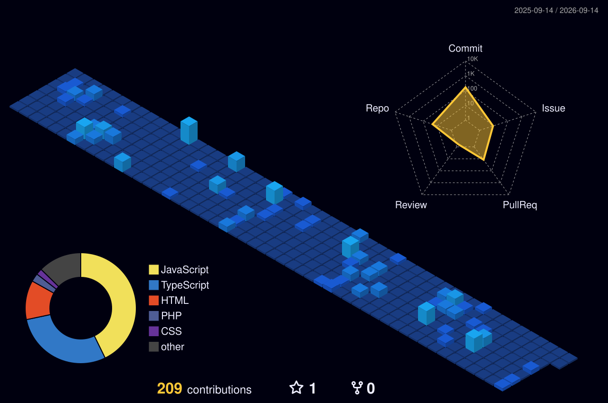

<!-- 🕷️ ARYAN SHETTAR — Spider-Man Themed README -->
<!-- Red #E23636 · Blue #1F3A93 -->

 

&nbsp;
&nbsp;
&nbsp;

---

## 🕷️ About Me

I've been on computers since I was a kid — breaking things, fixing them, and figuring out how everything works under the hood. That curiosity never went away; it just turned into code.

Now I'm an **ISE student** and **Software Dev Intern at Zysk Technologies**, building full-stack apps and diving deep into **AI Engineering** — LLMs, RAG, Agentic AI — because I believe the most impactful products will live at the intersection of AI and great software engineering.

I'm the type who starts a side project at midnight because an idea won't let me sleep. That same energy helped me build a **250K+ follower** community from scratch.

> *Always learning. Always building. Always curious.* 🕸️

 

---

## 🎧 Now Playing

🕷️ Spider-Man: Into the Spider-Verse OST · Click to play

---

## 🛠️ Tech Stack

---

## 🕸️ What I've Built

### [🚀 GoViral Pro](https://github.com/Aryanshettar007/GoViral-Pro)
AI-powered influencer marketing platform with ML-based pricing  
`React` `Node.js` `Flask` `Stripe` `Socket.io` `TailwindCSS`

 

### [🏥 MediFind](https://github.com/Aryanshettar007/MediFind-Impact-X)
AI-powered medical assistant with smart pharmacy recommendation  
`OCR` `Google Maps API` `Machine Learning` `Python`

 

### [⚖️ LegalEase](https://github.com/Aryanshettar007/LegalEase)
AI Legal Document Assistant with intelligent analysis  
`RAG` `OCR` `MERN Stack` `JWT Auth`

 

### [💬 QuickGPT](https://github.com/Aryanshettar007/QUICKGPT)
AI Chat Platform powered by Gemini  
`MERN Stack` `Gemini API` `Stripe` `ImageKit`

---

## 🏆 Achievements

🥇 **Top 10 Finalist** — Nasiko Buildathon @ Microsoft Bengaluru  
🏅 **Top 10** — SJBIT Hackathon  
📱 Built a **250K+ follower** Instagram community  
📜 **NPTEL Machine Learning** — Elite Certificate  
🤖 **Oracle AI Foundations** Certified  

---

## 📊 GitHub Stats

  

---

## 🐍 Contribution Snake

<picture>
  <source media="(prefers-color-scheme: dark)" srcset="https://raw.githubusercontent.com/Aryanshettar007/Aryanshettar007/output/github-snake-dark.svg" />
  <source media="(prefers-color-scheme: light)" srcset="https://raw.githubusercontent.com/Aryanshettar007/Aryanshettar007/output/github-snake.svg" />
  
</picture>

---

## 🏙️ 3D Contributions

<!-- This image is auto-generated by the GitHub-Profile-3D-Contrib workflow -->

---

### 🕷️ *"With great power comes great responsibility."*

⭐ Thanks for swinging by — drop a ⭐ if something caught your eye!

